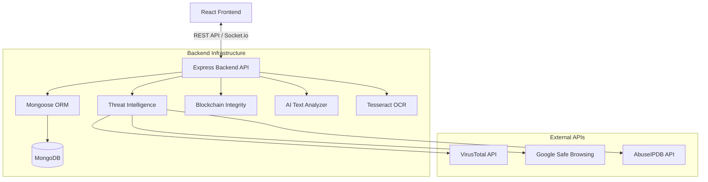
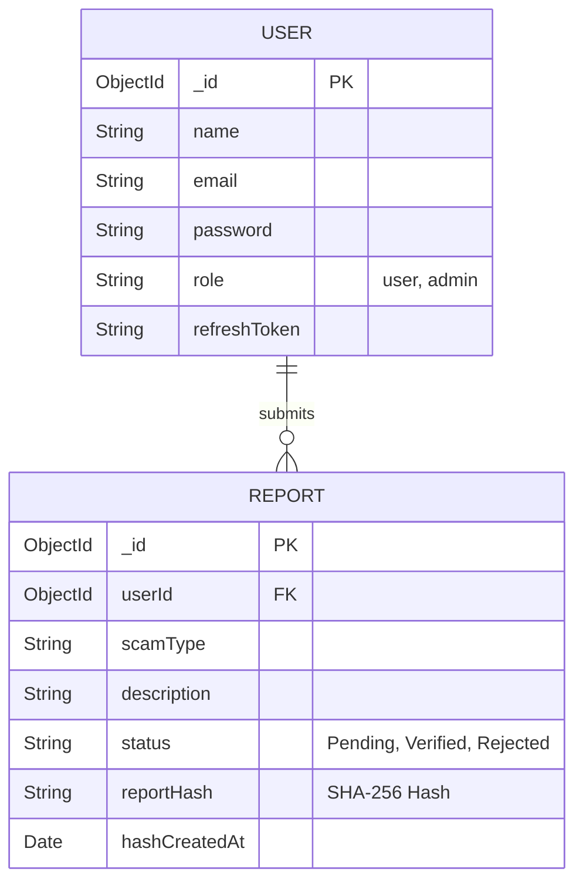
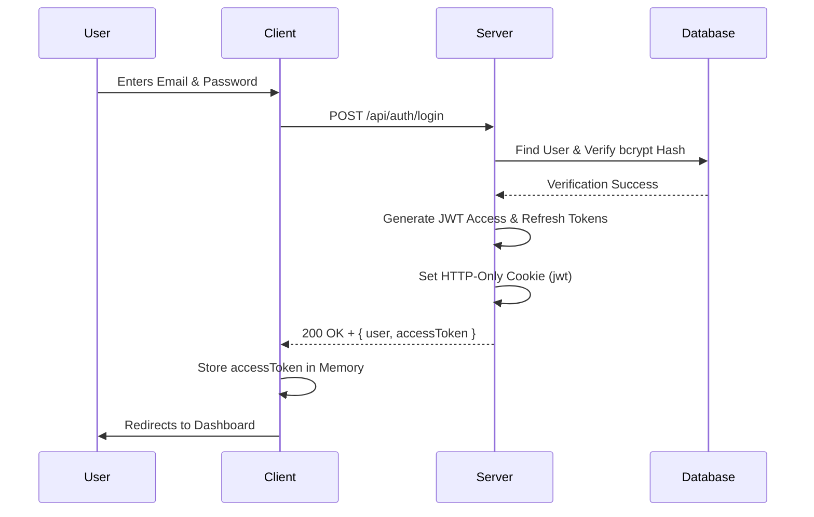
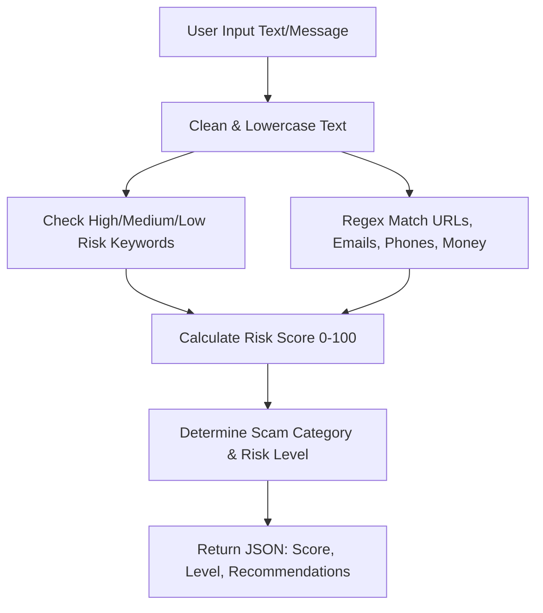
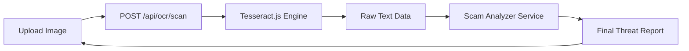
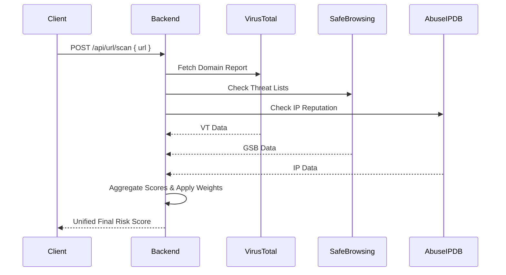
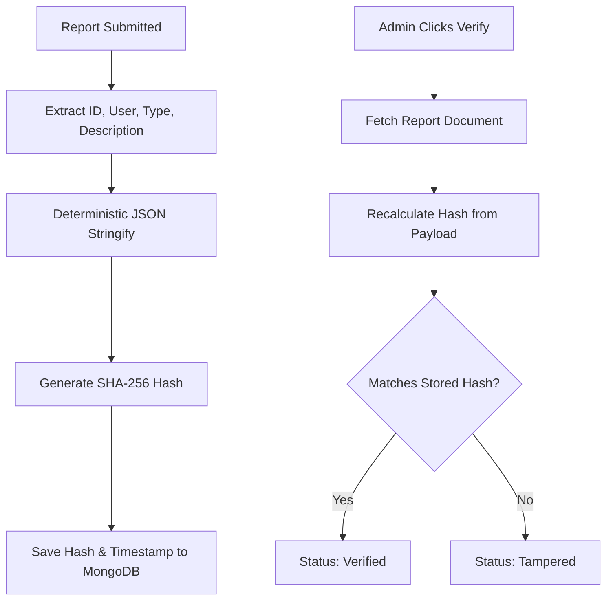

# Architecture & Design

This document outlines the high-level architecture, database schemas, and logical data flows of the CyberShield platform.

## 1. System Architecture Diagram

## 2. Database ER Diagram

## 3. Authentication Flow Diagram

## 4. AI Analysis Flow Diagram

## 5. OCR Processing Flow

## 6. Threat Intelligence Flow

## 7. Blockchain Integrity Flow

